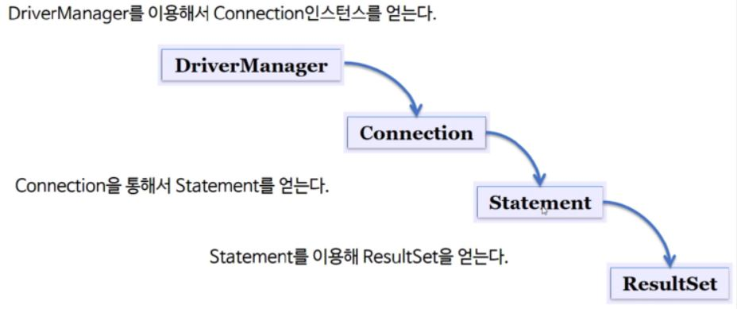

# 직업 관련 파일

**목차**   
[JDBC 사용 방법](#jdbc-사용-방법)  
[드라이버 로드](#드라이버-로드)  
[Connection 객체](#connection-%ea%b0%9d%ec%b2%b4)  
[Statement 생성 및 질의 수행](#statement-생성-및-질의-수행)
[결과 사용 및 객체 닫기](#결과-사용-및-객체-닫기)

## **JDBC 사용 방법**

1. import java.sql.*;로 import 
2. 드라이버 로드
3. Connection객체 생성
4. Statement 객체 생성 및 질의 수행
5. SQL문에 결과물이 있다면 ResultSet 객체 생성 (주로 Select문)
6. 모든 객체 닫음(열었던 반대 순서대로)



## **드라이버 로드**

각각의 DB에 맞게 접속할 수 있는 드라이버 객체 생성

```
mySQL의 경우

Class.forName("com.mysql.jdbc.Driver");

Oracle의 경우

Class.forName("oracle.jdbc.driver.OracleDriver");
```

위의 코드를 하면 Driver 객체가 메모리에 올라감

## **Connection 객체**

DB가 접속됐을 때 얻어지는 객체
DriverManager를 통해 Connection객체를 얻을 수 있다.

Connection은 interface고 각각의 DB에 따라 벤더가 구현하고 있는 객체여야 한다.  

이 벤더를 통해 라이브러리를 사용할 수 있는데 이러한 기능을 수행하는 것이 드라이버 로드라고 한다.

```
mySQL의 경우

String db_url = "jdbc:mysql://localhost/dbName";
Connection con = DriverManager.getConnection(db_url,ID,PW);

Oracle의 경우
String db_url = "jdbc:oracle:thin:@117.16.46.111:1521:xe"; // ip
Connection con = DriverManager.getConnection(db_url,ID,PW);
```

## **Statement 생성 및 질의 수행**

질의 수행을 위한 질의 상태 등을 담을 Statement 객체 생성

```
Statement stmt = con.createStatement();
```

후에 이 Statement 객체에 수행할 질의 선언 및 결과가 필요하면 결과 객체 ResultSet에 저장

```
ResultSet rs = stmt.executeQuery("select no from user");

쿼리에 따른 실행 메서드

stmt.execute("query");          // any SQL
stmt.executeQuery("query");     // SELECT
stmt.executeUpdate("query");    // INSERT, UPDATE, DELETE
```

### **결과 사용 및 객체 닫기**

```
ResultSet rs = stmt.executeQuery("select no from user");

while(rs.next())    // 결과 값이 많으면 메모리 부하적인 문제로 인해 하나씩 꺼내옴
    System.out.println(rs.getInt("no"));


Close

rs.close();
stmt.close();
con.close();
```