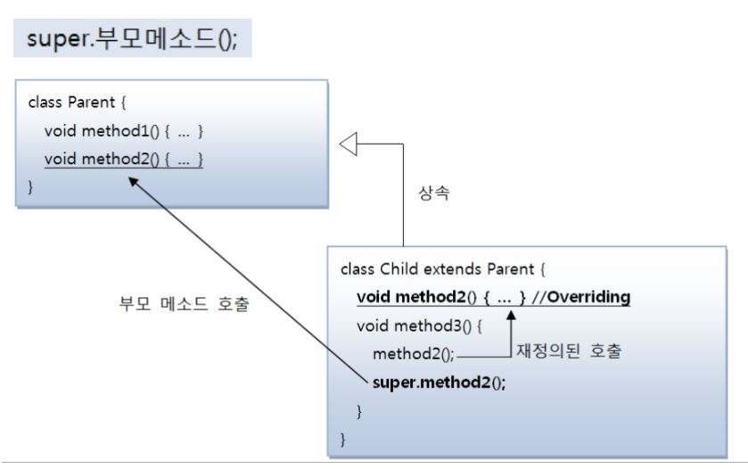
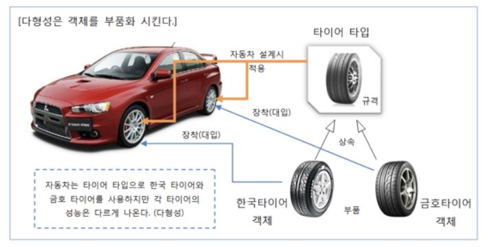

# Java

**목차**  

[1. Java 특징](#Java-특징)  
- [함수적 스타일 코딩을 지원한다](#함수적-스타일-코딩을-지원한다)  
- [메모리를 자동으로 관리한다](#메모리를-자동으로-관리한다)
- [멀티 스레드(Multi-Thread)를 쉽게 구현할 수 있다](#멀티-스레드(multi-thread)를-쉽게-구현할-수-있다)
- [동적 로딩(Dynamic Loading)을 지원한다](#동적-로딩(dynamic-loading)을-지원한다)

[2. 데이터 타입 종류](#데이터-타입-종류)  
- [리터럴](#리터럴)
- [기본 타입](#기본-타입(primitive-type))  
  - [종류](#종류)  
- [참조 타입](#참조-타입(reference-type))  
  - [종류](#종류)  
- [기본 타입 vs 참조 타입](#기본-타입-vs-참조-타입)  
- [Long과 Float의 사용 시 주의](#long과-float의-사용-시-주의)
- [Boolean 사용 시 주의](#boolean-사용-시-주의)

[3. 연산자](#연산자)
- [부호 연산자 사용 시 주의](#부호-연산자-사용-시-주의)
- [증감연산자(++i)와 i=i+1의 연산 속도](#증감연산자(++i)와-i=i+1의-연산-속도)
- [비트 반전 연산자(~)](#비트-반전-연산자(~))
- [산술 연산자](#산술-연산자)
  - [산술 연산의 예외](#산술-연산의-예외)
- [산술 연산자(+)와 문자열 연결 연산자(+)](#산술-연산자(+)와-문자열-연결-연산자(+))
- [비교 연산자](#비교-연산자)
  - [float 타입 비교 시 주의](#float-타입-비교-시-주의)
- [String 객체 참조](#string-객체-참조)  
- [String 비교](#string-비교)  
  - [참조 객체 번지 비교](#참조-객체-번지-비교)  
  - [문자열 비교](#문자열-비교)  
- [Java 연산에서 산출 타입이 int인 이유](#java-연산에서-산출-타입이-int인-이유)

[4. 반복문](#반복문)
- [향상된 for문](#향상된-for문)

[5. JVM](#jvm(java-virtual-machine))  
- [메모리 사용 영역](#메모리-사용-영역)  
  - [메소드 영역](#메소드-영역)
  - [힙 영역](#힙-영역)
  - [스택 영역](#스택-영역)  
  
[6. 객체와 클래스](#객체와-클래스)  
- [클래스](#클래스)  
  - [인스턴스](#인스턴스)
  - [객체 생성](#객체-생성)
  - [구성 멤버](#구성-멤버)
- [객체 간의 관계](#객체-간의-관계)  
  - [종류](#종류)
- [정적 멤버와 static](#정적-멤버와-static)  
  - [정적 멤버](#정적-멤버)  
  - [정적 멤버 선언](#정적-멤버-선어)
  - [static 선언 판단 기준](#static-선언-판단-기준)
  - [정적 초기화 블록](#정적-초기화-블록)  
- [캡슐화](#캡슐화)
  - [캡슐화 사용 이유](#캡슐화-사용-이유)  
- [싱글톤(Singleton)](#싱글톤(singleton))
- [Final](#final)
  - [Final 필드](#final-필드)
  - [Final 클래스](#final-클래스)
  - [Final 메소드](#final-메소드)
  - [Final과 상수(static final)차이](#final-필드와-상수(static-final)-차이)
- [상속](#상속)
  - [상속의 효과](#상속의-효과)
  - [상속의 제한](#상속의-제한)
- [super()](#super())
- [오버라이딩](#오버라이딩)
- [다형성](#다형성)
## **Java 특징**

### **함수적 스타일 코딩을 지원한다**

최근 들어 대용량 데이터의 병렬 처리 그리고 이벤트 지향 프로그래밍에 적합한 함수적 프로그래밍이 다시 부각되고 있는데, 자바는 함수적 프로그래밍을 위해 람다식을 `자바 8(Java8)`부터 지원한다.  

람다식을 사용하면 컬렉션의 요소를 필터링, 매핑, 집계 처리하는데 쉬워지고, 코드가 매우 간결해진다.

### **메모리를 자동으로 관리한다**

C++은 메모리에 생성된 객체를 제거하기 위해 개발자가 직접 코드를 작성해야 한다. 만약 이 작업을 해주지 않으면, 프로그램은 불완전해지고 갑자기 다운되는 현상을 겪게 된다.  

자바는 개발자가 직접 메모리에 접근할 수 없도록 설계(`Vertual Memory 사용`)되었으며, 메모리는 자바가 직접 관리한다. 객체 생성 시 자동적으로 메모리 영역을 찾아서 할당하고, 사용이 완료된면 `Garbage Collector`를 실행시켜 자동적으로 사용하지 않는 객체를 제거시켜준다. 따라서, 개발자는 메모리 관리의 수고스러움을 덜고, 핵심 기능 코드 작성에 집중할 수 있다.

### **멀티 스레드(Multi-Thread)를 쉽게 구현할 수 있다**  

하나의 프로그램이 동시에 여러 가지 작업을 처리해야 할 경우와 대용량 작업을 빨리 처리하기 위해 서브 작업으로 분리해서 병렬 처리하려면 멀티 스레드 프로그래밍이 필요하다. 프로그램이 실행되는 운영체제에 따라 멀티 스레드를 구현하는 방법이 다르지만, 자바는 스레드 생성 및 제어와 관련된 라이브러리 API를 제공하고 있기 때문에 운영체제에 상관없이 멀티 스레드를 쉽게 구현할 수 있다.

### **동적 로딩(Dynamic Loading)을 지원한다**

어플리케이션이 실행될 때 모든 객체가 생성되지 않고, 객체가 필요한 시접에 클래스를 동적 로딩해서 객체를 생성한다. 또한 개발 완료 후 유지보수가 발생하더라도 해당 클래스만 수정하면 되므로 전체 어플리케이션을 다시 컴파일 할 필요가 없다. 따라서 유지보수를 쉽고 빠르게 진행 할 수 있다.

## **데이터 타입 종류**

### **리터럴**

리터럴은 입력값이다.  
상수(값이 변하지 않는 수)와 원래 뜻은 같지만 프로그래밍 적으론 다르다.

### **기본 타입(primitive type)**

 - 원시 타입이라고 함
 - byte, char, short, int, long, float, double, boolean을 이용해서 선언

### 종류

1. 정수
2. 실수
3. 문자
4. 논리 리터럴


### **참조 타입(reference type)**

 - 객체의 번지를 참조하는 타입

### 종류

1. 배열 타입
2. 열거 타입
3. 클래스
4. 인터페이스


### **기본 타입 vs 참조 타입**

기본 타입은 실제 값을 변수 안에 저장
참조 타입은 메모리의 번지를 값으로 저장

ex)
```
[기본 타입 변수]  
int age = 25;  
double price = 100.5;  

[참조 타입 변수] 
String name = "신용권";  
String hobby = "독서";  
```


### **String 객체 참조**

```
같은 String 객체 참조
String name1 = "신용권";
String name2 = "신용권";
```

 

```
다른 String 객체 참조
String name1 = new String("신용권");
String name2 = new String("신용권");
```


### **Long과 Float의 사용 시 주의**

Long에는 l이나 L을 붙일 수 있다. 4 바이트가 아닌 8바이트를 사용한다고 알리는 것이다.  
만약 int 값을 넘는데 L이 안붙어 있으면 에러가 발생한다.

```
int var = 1000000000000;    // 에러 발생
```

비슷한 이유로 자바는 실수 리터럴의 기본 타입이 double이라 float를 사용하려면 변수 값 뒤에 f나 F를 붙여야한다.

```
float var = 3.14F;
```

### **Boolean 사용 시 주의**

자바는 true와 false를 0과 양수로 나타낼 수 없다. 따라서 c와 C++처럼 while문의 조건부에 1을 넣으면 에러가 발생한다.

```
while(1){   // 에러 발생

}
```

## **연산자**

### **부호 연산자 사용 시 주의**

부호 연산의 산출 타입은 int이다. 따라서 Short 타입에 부호 연산을 하면 int 타입으로 바뀌어 에러가 발생한다.

```
short s = 100;
short result = -s; // 에러 발생

short s = 100;
int result = -s; // 정상 작동
```

### **증감연산자(++i)와 i=i+1의 연산 속도**

많은 사람들이 i=i+1이 연산 횟수가 = 연산, + 연산으로 ++i 보다 느리다고 생각하지만 실제로 컴파일하면 ++i와 i=i+1은 동일한 바이트 코드가 생성된다. 따라서 둘 중 어떤 것이 연산속도가 빠르다고 볼 수는 없다.

### **비트 반전 연산자(~)**

비트 반전 연산자는 정수 타입(byte, short, int, long)의 피연산자에만 사용되며, 피연산자를 2진수로 표현했을 때 0을 1로, 1을 0으로 반전한다.  
연산 후, 부호 비트인 최상위 비트를 포함해서 모든 비트가 반전되기 때문에, 부호가 반대인 새로운 값이 산출된다.

이때, 비트 반전 연산자의 산출 타입은 int 타입이된다. 따라서, 아래의 코드는 에러가 발생한다.

```
byte var = 10;
byte result = ~v1; // 에러 발생
```

부호가 반대인 정수를 구할 때는 ~연산자 산출값에 +1을 해주면 된다.

### **산술 연산자**

산술 연산은 기본적으로 같은 타입끼리 하는 것을 전제한다. 따라서 데이터 손실이 일어날 수 있을 경우, 작은 타입보다 큰 타입을 기준으로 자동 형변환하여 연산한다.

### 산술 연산의 예외

1. 피연산자들이 모두 정수 타입이고, int 타입(4byte)보다 크기가 작은 타입일 경우 모두 int 타입으로 변환 후 연산을 수행한다. 따라서 연산의 산출 타입은 int이다.

```
byte + byte -> int + int = int

byte byte1 = 1;
byte byte2 = 1;
byte byte3 = byte1 + byte2; // 에러 발생

참고로 char도 유니코드를 통해서 연산이 가능하다.

char + int -> int + int = int

char c1 = 'A'(65) + 1; -> B(66) 저장
char c2 = 'A';
char c3 = c2 + 1; // 에러 발생

c1에서 에러가 안나는 이유는 자바는 리터럴 간의 연산은 타입 변환 없이 해당 타입으로 계산하기 때문이다.
```

2. 피연산들이 모두 정수 타입이고, long 타입이 있을 경우 모두 long 타입으로 변환 후, 연산을 수행한다. 따라서 연산의 산출 타입은 long이다.

```
int + long -> long + long = long
```

3. 피연산자 중 실수 타입(float 타입, double 타입)이 있을 경우, 크기가 큰 실수 타입으로 변환 후, 연산을 수행한다. 따라서 연산의 산출 타입은 실수 타입이다.

```
int + double -> double + double = double
```

### **산술 연산자(+)와 문자열 연결 연산자(+)**

+는 부호 연산자, 산술 연산자, 문자열 연결 연산자의 역할을 모두 수행한다.  
그럼 +연산자가 산술 연산자인지 문자열 연결 연산자인지 판단하기 어려울 때는 어떻게 할까?  

문자열과 숫자가 혼합된 +연산식은 왼쪽에서 오른쪽으로 연산이 진행된다.

```
"JDK" + 3 + 3.0;    // "JDK33.0"
3+ 3.0 + "JDK";     // "6.0JDK"
```

### **비교 연산자**

### **float 타입 비교 시 주의**

0.1 == 0.1f의 경우 0.1f가 좌측 피연산자의 타입인 double로 변환되어 0.1 == 0.1이 되고 true가 산출되어야 하지만, 결과는 false가 산출된다. 그 이유는 이진 포맷의 기수를 사용하는 모든 부동소수점 타입은 0.1을 정확히 표현할 수 없어 0.1f는 0.1dml 근사값으로 표현되어 0.10000000149011612와 같은 값이 되기 때문에 0.1보다 큰값이 되어 버린다.

### **String 비교**

### 참조 객체 번지 비교

```
String name1 = "신민철";
String name2 = "신민철";
String name3 = new String("신민철");

name1==name2 (true)
name1==name3 (false)
```

### 문자열 비교

```
boolean result = str1.equals(str2);
str1 - 원본 문자열
str2 - 비교 문자열
```

### **Java 연산에서 산출 타입이 int인 이유**

자바 가상 기계(JVM)의 기본 연산 단위가 32비트이기 때문이다.

## **반복문**

### **break문**

반복문이 중첩되어 있을 경우 bread문은 가장 가까운 반복문만 종료하고 바깥쪽 반복문은 종료시키지 않는다.  
중첩된 반복문에서 바깥쪽 반복문까지 종료시키려면 바깥쪽 반복문에 Label을 붙이고, `break 이름;`을 사용하면 된다.

```
Label: for(···){
    for(···){
        beak Label;
    }
}
```

### **향상된 for문**

향상된 for문은 반복 실행을 하기 위해 카운터 변수와 증감식을 사용하지 않는다.  
배열 및 컬렉션 항목의 개수만큼 반복하고, 자동적으로 for문을 빠져나간다.

```
for(타입 변수 : 배열) {
    실행문
}
```

for문의 반복 횟수는 배열의 항목 수

## **JVM(Java Virtual Machine)**

자바 프로그램은 완전한 기계어가 아닌, 중간 단계의 바이트 코드이기 때문에 운영체제는 자바 프로그램을 바로 실행할 수 없다. 따라서, 이것을 해석하고 실행할 수 있는 가상의 운영체제가 필요하다. 이것을 자바 가상 기계(Java Virtual Machine)이라 한다.  

JVM은 실 운영체제를 대신해서 자바 프로그램을 실행하는 가상의 운영체제 역할을 한다. 따라서 개발자는 운영체제와 상관없이 자바 프로그램을 개발할 수 있다.

JVM은 JDK 또는 JRE를 설치하면 자동으로 설치되는데, 자바 프로그램을 운영체제가 이해하는 기계어로 번역해서 실행해야 하므로 JVM은 운영체제에 종속적이고 운영체제에 맞게 설치되어야 한다.

자바의 가장 큰 장점 중 하나인 "Write once, run anywhere"는 매우 매력적이지만, 한 번의 컴파일링으로 실행 가능한 기계어가 만들어지지 않고 JVM에 의해 기계어로 번역되고 실행되기 때문에 C와 C++의 컴파일 단계에서 만들어지는 완전한 기계어보다는 속도가 느리다는 단점을 가지고 있다.


### **메모리 사용 영역**

java.exe로 JVM이 시작되면 JVM은 운영체제에서 할당받은 메모리 영역(Runtime Data Area)을 다음과 같이 세부 영역으로 구분해서 사용


### 메소드 영역(Method)

코드에서 사용되는 클래스들을 클래스 로더로 읽어 클래스 별로 런타임 상수풀(Runtime constant pool), 필드 데이터(Field data), 메소드 데이터(Method data), 메소드 코드, 생성자 코드(Constructor)로 분류해서 저장

메소드 영역은 JVM이 시작할 때 생성되고 모든 스레드가 공유하는 영역

### 힙(Heap) 영역

객체와 배열이 생성되는 영역

힙 영역에 생성된 객체와 배열은 JVM 스택 영역의 변수나 다른 객체 필드에서 참조

참조하는 변수나 필드가 없다면 의미 없는 객체가 되어 JVM은 쓰레기 수집기(Garbage Collector)을 실행시켜 힙 영역에서 자동으로 제거  
-> 자바에선 코드로 객체를 직접 제거할 필요 없음(사실은 방법을 제공 x)

### JVM 스택(Stack) 영역

각 스레드마다 하나씩 존재하며 스레드가 시작될 때 할당

추가적 스레드를 생성하지 않으면 main스레드 하나만 존재

메소드를 호출할 때마다 프레임(Frame)을 추가(push)하고 메소드가 종료되면 해당 프레임을 제거(pop)하는 동작 수행

프레임 내부에 로컬 변수 스택이 존재  
-> 기본 타입 변수와 참조 타입 변수가 추가(Push) 되거나 제거(Pop) 됨  
-> 변수가 이 영역에 생성되는 시점은 초기화가 될 때 이다(생성될 때 X)  
-> 변수는 선언된 블록에서만 스택에 존재

## **객체와 클래스**

## **클래스**

객체의 설계도가 클래스(Class)이다.

파일 이름과 동인한 클래스의 선언에만 public 접근 제한자를 붙일 수 있다.
-> 만약 파일 이름과 일치하지 않는 클래스 선언에 public 접근 제한자를 붙이면 컴파일 에러가 발생한다.

### **인스턴스**

클래스로부터 만들어진 객체를 해당 클래스의 인스터스(instance)라고 한다.

### **객체 생성**

```
new 클래스(); (new 생성자;)
```
new는 힙 영역에 객체를 생성시킨 후, 객체의 주소를 리턴

### **구성 멤버**

1. 필드 
    - 객체의 고유 데이터, 부품 객체, 상태 정보 저장
    - 변수는 생성자, 메소드와 life time 동일
    - 필드는 객체와 life time 동일

2. 생성자
    - 객체 생성 시 초기화
    - 클래스 이름으로 되어 있고 리턴 타입이 없다.
    - 생성자 오버로딩 시 생성자 간의 중복 코드 발생 가능  
&nbsp;&nbsp;&nbsp;&nbsp;-> this()이용.  
&nbsp;&nbsp;&nbsp;&nbsp;&nbsp;&nbsp;&nbsp;&nbsp;필드 초기화 내용은 한 생성자에만 집중하고 나머지 생성자는 초기화 내용을 가지고 있는 생성자를 호출
```
클래스( [매개변수 선언, ...]) {
    this(매개변수,...,값,...);
    실행문;
}
```
  
3. 메소드

### **매개 변수의 수를 모를 경우**

메소드의 매개 변수는 개수가 이미 정해져 있는 것이 일반적이지만, 정해져 있지 않다면 배열을 사용하여 해결 할 수 있다. 하지만 배열을 사용하려면 메소드 호출 전에 배열을 생성해야 하는 불편한 점이 있다. 그래서 배열을 생성하지 않고 값의 리스트만 넘겨주는 방법이 존재한다.

```
int sum(int ··· values) { }
```

이와 같이 매개 변수를 "···"을 사용해서 선언하게 되면, 메소드 호출 시 넘겨준 값의 수에 따라 자동으로 배열이 생성되고 매개값으로 사용된다.

### **실질적 사용**

```
[Student.java]
public  class Student {

}

[public class StudentExample]
public class StudentExample {
    public static void main(String[] args){
        Student s1 = new Student();
        System.out.println("s1 변수가 Student 객체를 참조합니다.");
        
        Student s2 = new Student();
        System.out.println("s2 변수가 또 다른 Student 객체를 찹조합니다.");
    }
}
```

s1 s2는 서로 독립된 객체 참조

**Student와 StudentExample 클래스의 용도**

Student는 라이브러리(API : Application Program Interface)용  
&nbsp;&nbsp;&nbsp;&nbsp;\- 다른 클래스에서 이용할 목적  
StudentExample은 실행용  
&nbsp;&nbsp;&nbsp;&nbsp;\- 프로그램의 실행 진입점인 main()메소드를 제공하는 역할

프로그램 전체에서 사용되는 클래스가 100개라면 99개는 라이브러리고 단 하나가 실행 클래스

### **객체 간의 관계**

객체는 개별적으로 사용될 수 있지만, 대부분 다른 객체와 관계를 맺고 있다.  
이 관계의 종류에는 집합 관계, 사용 관계, 상속 관계가 있다.

### 종류

1. 집합 관계
- 하나는 부품이고 하나는 완성품에 해당
- ex) 자동차 = 엔진, 타이어, 핸들 등으로 구성

2. 사용 관계
- 객체 간의 상호작용
- 객체는 다른 개체의 메소드를 호출하여 원하는 결과를 얻어냄
- ex) 사람은 자동차를 사용 -> 달린다, 멈춘다 등의 메소드 호출

3. 상속 관계
- 상위(부모) 객체를 기반으로 하위(자식) 객체를 생성하는 관계
- 일반적으로 상위 객체는 종류, 하위 객체는 구체적인 사물


### **정적 멤버와 static**

### 정적 멤버

클래스에 고정된 멤버로서 객체를 생성하지 않고 사용할 수 있는 필드와 메소드

이들은 각각 정적 필드와 정적 메소드라고 한다.

정적 멤버는 객체(인스턴스 instance)에 소속된 멤버가 아니라 클래스에 소속된 멤버이기 때문에 클래스 멤버라고도 한다.

### 정적 멤버 선언

정적 필드와 정적 메소드를 선언하는 방법은 필드와 메서드 선언 시 static 키워드를 추가적으로 붙이면 된다. 
```
public class 클래스 {
    // 정적 필드
    static 타입 필드 [= 초기값];

    // 정적 메소드
    static 리턴 타입 메소드 (매개변수 선언, ...) {...}
}
```
정적 필드와 정적 메소드는 클래스에 고정된 멤버로 클래스 로더가 클래스(바이트 코드)를 로딩해서 메소드 메모리 영역에 적재할 때 클래스별로 관리된다. 따라서 클래스의 로딩이 끝나면 바로 사용할 수 있다.

주로 클래스 이름과 함께 도트(.)연산자로 접근한다.


### static 선언 판단 기준

1. 필드를 선언할 때  
객체마다 가지고 있어야 할 데이터라면 인스턴스 필드로 선언하고,
객체마다 가지고 있을 필요성 없이 공용적인 데이터라면 정적 필드로 선언하는 것이 좋다.

ex) 계산기의 파이는 모든 계산기가 가지고 있어야 할 공용적인 데이터 이므로 정적 필드, 크기(size)는 계산기 마다 다를 수 있으므로 인스턴스 필드로 선언
```
public class Calculator {
    String size;
    static double pi = 3.14159;
}
```

2. 메소드를 선언할 때
인스턴스 필드를 이용해서 실행해야 한다면 인스턴스 메소드로 선언하고,
인스턴스 필드를 이용하지 않는다면 정적 메소드로 선언

ex) 계산기 클래스의 덧셈과 뺄셈 기능은 인스턴스 필드를 이용하기 보다는 외부에서 주어진 매개값들을 가지고 덧셈과 뺄셈을 수행하므로 정적 메소드로, 인스턴스 필드인 색깔을 변경하는 메소드는 인스턴스 메소드로 선언해야 한다.

### 정적 초기화 블록

정적 필드 초기화 시 계산이 필요한 초기화 작업이 필요할 수 있다.
인스턴스 필드는 생성자에서 초기화 하지만, 정적 필드는 객체 생성 없이도 사용되므로 생성자에서 초기화 작업 불가능
-> 정적 블록(static block)을 제공

```
static {
    ...
}
```

정적 블록은 클래스가 메모리로 로딩될 때 자동적으로 실행

클래스 내부에 여러개 선언되어도 상관없음
클래스가 메모리로 로딩될 때 선언된 순서대로 실행

정적 블록내부에는 인스턴스 필드나 메소드(또한, this)를 사용할 수 없다.
정적 블록에서 인스턴스 멤버를 사용하고 싶다면 객체를 먼저 생성하고 참조 변수로 접근해야 한다.

### 사용 시 주의 사항

1. 블록 내부의 인스턴스 필드나 인스턴스 메소드 사용불가
2. 객체 자신의 참조인 this 사용 불가
3. 구동시 전부 일괄적으로 호출되어 메모리가 과부하가 걸려 오래걸릴 여지가 있으며 가비지 컬렉션의 시기가 정해져 있지 않아 언제 삭제가 될지 모름

### **캡슐화(Encapsulation)**

객체의 필드, 메소드를 하나로 묶고, 실제 구현 내용을 감추는 것을 말한다.  
외부 객체는 객체 내부의 구조를 알지 못하며 객체가 노출해서 제공하는 필드와 메소드만 이용할 수 있다.

캡슐화된 멤버를 노출시킬 것인지 결정하기 위해 접근 제한자(Access Modifier)를 사용한다.

접근 제한자는 객체의 필드와 메소드의 사용 범위를 제한함으로써 외부로부터 보호한다.

### 캡슐화 사용 이유

외부의 잘못된 사용으로 인해 객체가 손상되지 않도록 하는 데 있다.  
즉, 정보 은닉의 이유로 사용된다.


### **싱글톤(Singleton)**

전체 프로그램에서 단 하나의 객체만 만들도록 보장해야 하는 경우, 이 단 하나의 객체를 싱글톤(Singleton)이라 한다.

생성자를 호출한 만큼 객체가 생성되기 때문에 싱글톤을 만들려면 클래스 외부에서 new 연산자로 생성자를 호출할 수 없도록 막아야 한다.
-> private 접근 제한자를 붙여 가능

그리고 자신의 타입인 정적 필드를 하나 선언하고 자신의 객체를 생성해 초기화한다.(클래스 내부에서는 new 연산자로 생성자 호출이 가능하다.)
정적 필드도 private 접근 제한자를 붙여 외부에서 필드값을 변경하지 못하도록 막아야 한다. 대신 외부에서 호출할 수 있는 정적 메소드인 getInstance()를 선언하고 정적 필드에서 참조하고 있는 자신의 객체를 리턴해준다.

```
public class 클래스 {
    // 정적 필드
    private static 클래스 singleton = new 클래스();

    // 생성자
    private 클래스() {

    }

    // 정적 메소드
    static 클래스 getInstance() {
        return singleton;
    }
}

getInstance() 메소드는 단 하나의 객체만 리턴하기 때문에 클래스.getInstance()는 모두 같은 객체를 참조한다.
```
### **final**

### final 필드
final 필드는 초기값이 저장되면 이것이 최종적인 값이 되어서 프로그램 실행 도중에 수정할 수 없다.

### final 클래스
final 클래스는 최종적인 클래스로 부모로 사용할 수 없는 클래스를 말한다. 즉, 상속을 통한 확장이 불가능하다.

```
class Child extends Parent {
    
}
의 Parent 자리에 올 수 없다. 즉, 자식 클래스를 만들지 못하도록 한다.
```

상속을 금지하는 방법

1. final로 선언
2. 모든 생성자를 private나 패키지 전용으로 하고, 생성자 대신 public static 팩토리 메소드를 주가하는 방법

서브클래스를 안전하게 만들려면 클래스를 확장 가능하게 설계하는 것과 확장 불가능한 클래스로 설계 하는 것 두가지 방법이 있다.

### final 메소드

자식이 재정의할 수 없는 메소드가 된다.

```
public final 리턴타입 메소드(매개변수, ...){...}
```

### final 필드와 상수(static final) 차이

final이 한 번 초기화되면 수정할 수 없는 필드이므로 상수와 다르지 않은 것 같지만, 상수는 객체마다 저장할 필요가 없는 공용성을 띠고 있으며 여러 가지 값으로 초기화될 수 없다. 따라서, 객체마다 저장되고, 생성자의 매개값을 통해서 여러 가지 값으로 초기화 될 수 있는 final은 상수와 다르다. 그러므로 만약, 상수를 표현하고 싶다면 static과 final을 모두 사용해야 한다.

### **상속**

### **상속의 효과**

1. 부모 클래스를 재사용해서 자식 클래스를 빨리 개발할 수 있다.
2. 코드의 중복을 줄여준다.
3. 유지 보수의 편리성을 제공
4. 객체의 다형성을 구현할 수 있다.

### **상속의 제한**

1. 부모 클래스의 private 접근을 갖는 필드와 메소드는 제외
2. 부모 클래스가 다른 패키지에 있을 경우, default 접근을 갖는 필드와 메소드도 제한
3. 자바는 다중 상속을 허용하지 않기 때문에 부모 클래스를 나열할 수 없다.([자바가 다중상속을 지원하지 않는 이유](https://github.com/dnwlsrla40/ISSUE_Repo/blob/master/Java/Java%EA%B0%80%20%EB%8B%A4%EC%A4%91%EC%83%81%EC%86%8D%EC%9D%B4%20%EC%95%88%EB%90%98%EB%8A%94%20%EC%9D%B4%EC%9C%A0.md))

```
class 자식클래스 extends 부모클래스1, 부모클래스 2{
    error 발생
}
-> interface로 다중 상속의 효과를 낼 수 있음
```

### **super()**

자식 객체를 생성할 때는 부모 객체부터 생성되고 자식 객체가 생성된다. 만약 부모가 없을 땐 기본 Object(최상위 객체)를 상속받는다.

즉 부모 생성자가 호출 완료되고, 자식 생성자가 나중에 호출 완료된다.

만약 자식 생성자에 super(); 메소드가 없다면 자동적으로 호출을 한다.

```
자식클래스{
    자식클래스 생성자(매개변수){
        super(매개변수값); // 반드시 자식 생성자의 첫줄에 위치
    }
}
```

- 부모클래스에 기본(매개변수 없는)생성자가 없다면 필수적으로 작성
- 반드시 자식 생성자의 첫줄에 위치
- super(매개변수)로 오버로딩된 다른 부모 생성자를 호출 가능

### **오버라이딩**

오버라이딩(Overriding)은 부모클래스에게 상속받은 메소드가 자식클래스의 내용과 맞지 않을 경우 동일한 메소드를 "재정의" 하는 것을 말한다.

오버라이딩이 되면 부모 객체의 메소드는 숨겨지기 때문에 자식 객체에서 메소드를 호출하면 오버라이딩 된 자식 메소드가 호출된다.

오버라이딩 된 자식 메소드가 아닌 부모메소드를 호출하고 싶으면 super.부모메소드()를 사용하여 호출한다.



### **다형성**

다형성(Polymorphism)은 같은 타입이지만 실행 결과가 다양한 객체를 대입할 수 있는 성질을 말한다.

객체의 부품화가 가능하다.



```
타입 변수이름 = new 생성될 객체();

즉 A가 B C의 부모 클래스면,

A a = new B();
A a = new C();
가 가능하다.

이것을 자동 타입 변환이라 한다. 

자식의 타입이 부모 타입으로 자동 변환
```

### 자동 타입 변환

프로그램 실행 도중 자동 타입 변환이 일어나는 것을 말한다.

기본 타입 변환과 똑같다. 다만, 객체의 자동 타입 변환은 두 객체가 서로 상속 관계이고 하위에서 상위 클래스로의 형 변환 인 경우에만 일어난다.

반대의 경우에는 인스턴스에 따라 실행 오류가 발생한다.

```
Cat cat = new Cat();
Animal animal = cat;

=> Animal animal = new Cat();

cat == animal // true

즉, 
int a = 5;
long b = a;

를 했을 때 b와 a 둘다 5를 가리킨다. 따라서,

a == b // true

라는 것이다.
```

자동 타입 변환된 이후에는

- 부모 클래스에 선언된 필드와 메소드만 접근 가능하다.
- 메소드가 재정의되었다면 자식 클래스의 재정의된 메소드가 호출된다.
 
예를 들어, (정확한 예시는 아니지만)

```
int a = 2.5;
``` 

에서 a에는 2라는 값만 들어간다. 그 이유는 a가 int형의 타입이기 때문이다.

객체의 형변환도 똑같이 

```
Animal animal = new Cat();
```

이라면, 부모 클래스에 선언된 필드와 메소드만 접근 가능하게 된다.
하지만, 오버라이딩 된 함수라면 자식 클래스의 메서드가 대신 호출된다.