# Spring

목차  
[들어가기 전](#들어가기-전)  
- [컨테이너](#컨테이너(container))
- [빈](#bean)
  - [빈 등록 방법 - applicationContext.xml에 빈을 등록하는 방법](#빈-등록-방법---applicationcontext.xml에-빈을-등록하는-방법)
  - [빈 등록 방법 - 어노테이션과 Config를 통해 빈을 등록하는 방법](#빈-등록-방법---어노테이션과-config를-통해-빈을-등록하는-방법)

[Spring](#Spring)  
- [IOC(Inversion of Control)](#ioc(inversion-of-control))  
- [DI(Dependency Injection)](#di(dependency-injection))
  - [Spring에서 제공하는 IoC/DI 컨테이너](#spring에서-제공하는-ioc/di-컨테이너)
- [스프링의 계층](#스프링의-계층)
  - [데이터 엑세스(Data Access) / 통합(Integration)](#데이터-엑세스(data-access)-/-통합(integration))
  - [웹(Web)](#웹(web))  
- [Spring JDBC](#spring-jdbc)
  - [JDBC 란?](#jdbc-란?)
  - [DAO 패턴](#dao-%ed%8c%a8%ed%84%b4)
  - [Spring JDBC 패키지](#spring-jdbc-%ed%8c%a8%ed%82%a4%ec%a7%80)
  - [JDBC Template](#jdbc-template)
  - [Connection Pool](#connection-pool)
  - [DataSource](#datasource)
  - [사용되는 쿼리관련 메서드](#사용되는-쿼리관련-메서드)
- [Spring MVC](#spring-mvc)
  - [Model](#model)
  - [View](#view)
  - [Controller](#controller)
  - [MVC Model 1 아키텍처](#mvc-model-1-아키텍처)
  - [MVC Model 2 아키텍처](#mvc-model-2-아키텍처)
  - [Spring MVC 구성요소](#spring-mvc-구성요소)
  - [DispatcherServlet 내부 동작 흐름](#dispatche   rservlet-내부-동작-흐름)

[Spring XML](#Spring-XML)  
 - [Web.xml](#webxml)
 - [root-context.xml](#root-contextxml)
 - [servlet-context.xml](#servlet-contextxml)

## **들어가기 전**

Frame Work 
- 개발하기 어려운 부분들에 대해 미리 어느정도 만들어 져있는 제품을 제공하는 것

예를 들어, 우리가 가구를 만들 때 어려움을 겪어서 어느정도 만들어져 있는 반 제품을 사서 나머지를 만드는 것과 비슷하다.


### **컨테이너(Container)**

컨테이너는 인스턴스의 생명주기를 관리한다.

생성된 인스턴스들에게 추가적인 기능을 제공한다.

예를 들면, Servlet을 실행해주는 WAS는 Servlet 컨테이너를 가지고 있다.

### **Bean**

공장이 자동으로 만들어 줄 객체 즉, IOC 컨테이너가 관리하는 객체를 말한다.  
스프링에서는 ApplicationContext가 컨테이너이므로 이 ApplicationContext가 관리하는 객체들을 '빈(Bean)'이라는 용어로 부른다. 

빈과 빈 사이의 의존관계를 처리하는 방식으로 1) XML 설정, 2) 어노테이션 설정, Java 설정 방식을 이용할 수 있다.

특징
1. 기본 생성자를 가지고 있다.
2. 필드는 private하게 선언한다.
3. getter, setter 메서드를 가진다.
    - getName(), setName() 메서드가 있다면 name 프로퍼티(property)라고 한다.

## **Spring**

- 프레임 워크중 하나로 엔터프라이즈급(규모가 큰) 어플리케이션을 구축할 수 있는 가벼운 솔루션이다.
- 전체를 사용하지 않고 원하는 부분만 가져다 사용할 수 있도록 모듈화가 잘 되어 있다.
- IoC 컨테이너다
- 선언적으로 트랜잭션을 관리할 수 있다.
- MVC Framework를 제공한다.
- AOP 지원한다.
- 도메인 논리 코드와 쉽게 분리될 수 있는 구조를 가지고 있다.

## **Spring 특징**

### **POJO 기반의 구성**

스프링은 다른 프레임워크들과 달리 관계를 구성할 때 별도의 API 등을 사용하지 않는 POJO(Plain Old Java Object)의 구성만으로 가능하도록 제작되어있다. 쉽게 말해서 일반적인 Java 코드를 이용해서 객체를 구성하는 방식을 그대로 스프링에서 사용할 수 있다.

즉, 개발자가 코드를 개발할 때 특정한 라이브러리나 컨테이너의 기술에 종속적이지 않는다. 개발자는 가장 일반적인 형태로 코드를 작성하고 실행할 수 있어 생산성에서도 유리하고, 코드에 대한 테스트 작업 역시 좀 더 유연하게 할 수 있다.

### **의존성 주입(DI)과 스프링

의존성은 하나의 객체가 다른 객체 없이 제대로 된 역할을 할 수 없다는 것을 의미한다. 즉, 의존성 주입은 '어떤 객체가 필요한 객체를 외부에서 제공해주는 것'을 의미한다.

하나의 클래스 내부에서 다른 클래스의 메서드나 필드를 이용하려는 경우 그 사용할 클래스가 인스턴스화 되어있어야 한다. 스프링은 `ApplicationContext`라는 존재가 필요한 객체들을 생성하고, 필요한 객체들을 주입하는 역할을 해준다.

따라서, 스프링을 이용하면 개발자들은 기존의 프로그래밍과 달리 객체와 객체를 분리해서 생성하고, 이러한 객체들을 엮는 작업을 하는 형태의 개발에 집중할 수 있다.

### **AOP의 지원**

프로그래밍에서 중요 원칙 중 하나는 '반복적인 코드의 제거'라고 할 수 있다. 스프링은 프레임워크를 이용한 개발에서 이러한 반복적인 코드를 줄이고, 핵심 비즈니스 로직에만 집중할 수 있는 방법으로 AOP(Aspect Oriented Programming)를 지원한다.

대부분의 시스템이 공통으로 가지고 있는 보안이나 로그, 트랜잭션과 같이 비즈니스 로직은 아니지만, 반드시 처리가 필요한 부분을 스프링에서는 '횡단 관심사(cross-concern)'이라고 한다. 스프링의 AOP는 이러한 횡단 관심사를 모듈로 분리하는 패러다임이다.

이를 통해서, 개발자는 1) 핵심 비즈니스 로직에만 집중해서 코드를 개발할 수 있고, 2) 각 프로젝트마다 다른 관심사를 적용할 때 코드의 수정을 최소화시킬 수 있으며, 3) 원하는 관심사의 유지보수가 수월한 코드를 구성할 수 있다.

### **트랜잭션의 지원**

데이터베이스를 이용할 때 반드시 신경 써야 하는 부분 중 하나는 하나의 업무가 여러 작업으로 이루어지는 경우의 트랜잭션 처리이다. 이 트랜잭션 처리는 상황에 따라 복잡하게 구성될 수 있고, 아닐 수도 있는데 그때마다 코드를 이용해서 처리하는 작업은 매우 힘든 일이다. 스프링은 이런 트랜잭션 관리를 어노테이션이나 XML로 설정 할 수 있어 개발자가 매번 상황에 맞는 코드를 작성할 필요가 없도록 설계되어있다.

## **IOC(Inversion Of Control)**

개발자가 프로그램의 흐름을 제어하는 코드를 작성하는데 이 흐름의 제어를 개발자가 하는 것이 아니라 다른 프로그램이 그 흐름을 제어하는 것을 IOC라 한다.

즉, 개발자가 만든 어떤 클래스나 메소드를 다른 프로그램이 대신 실행해주는 것을 말한다.


예를 들어, TV(인터페이스)에 관한 객체로 S_TV와 L_TV가 있다고 한다면,

우리는
```
Tv tv = new Class();
tv.메소드;
```
이러한 방식으로 사용할 것이다.

하지만, 이렇게 사용을 하면, S_TV와 L_TV에 따라서 Class나 메소드를 변경해줘야 하는 번거로움이 있다.

그래서, 이러한 부분을 대신 해주는 TVFactory 라는 것이 있다면

```
Tv tv = TvFactory.getTv("클래스");
tv.메소드;
```
방식으로 특정한 TVFactory가 uri 패턴이나 정보로 상황에 따라 getTv의 매개변수로 S_Tv나 L_Tv를 넣어줘 객체를 생성해주는 것이다.

여기서 TvFactory와 같은 프로그램의 역할은 Spring의 Bean Factory나 Application Context 같은 것이 해준다. 

## **DI(Dependency Injection)**

위의 IOC에서 공장으로 인스턴스를 만들었다면 사용을 하기 위해 이 객체를 받아와야한다.

DI는 이 객체를 받아오는 방법 중 하나로 의존성 주입이라고도 한다.

DI는 클래스 사이의 의존 관계를 빈(Bean) 설정 정보를 바탕으로 컨테이너가 자동으로 연결해주는 것을 말한다.

예를 들어, DI를 사용하지 않으면 개발자가 아래처럼 직접 인스턴스를 생성해야만 한다.

```
//DI 사용하지 않을 때
Class 엔진{

}

Class 자동차{
    엔진 v5 = new 엔진();
}
```


하지만, Spring에서 제공하는 DI를 사용하면 어노테이션을 이용하여 IOC/DI 컨테이너가 객체를 생성하도록 한다.

즉, 객체를 대신 메모리에 올려준다.

```
//Spring에서 DI를 사용할 때

@Component
Class 엔진{

}

@Component
Class 자동차{
    @Autowired
    엔진 v5;
}
```  

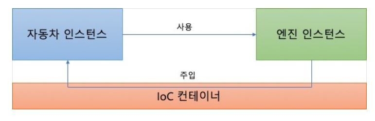

### **빈 등록 방법 - applicationContext.xml에 빈을 등록하는 방법** ###

applicationContext.xml 파일을 resource 폴더에 만들어서 등록을 해준다.
```
[applicationContext.xml]
id는 호출될 String이고, class는 연결 시킬 객체의 Class이다.
<bean id="userBean" class="kr.or.connect.diexamo1.UserBean"/>

[다른 곳에서의 사용 - main]
public static void main(String[] args) {
    ApplicationContext ac = new ClassPathXmlApplicationContext("classpath:applicationContext.xml");
    System.out.println("초기화 완료!!");
    UserBean userBean = (UserBean)ac.getBean("userBean"); // id = userBean 이다. getBean의 리턴형은 Object이므로 형변환 시켜주어야 한다.
    userBean.setAge(3);
    System.out.println(userBean.getAge());
}
```

Context를 통한 객체 생성은 한번 만 하므로 여러번 객체를 생성하는 것이 아니라 싱글톤 형식으로 동일한 하나의 객체를 만든다.
따라서, 프로그램이 실행이 될때 Context는 applicationContext.xml에 등록된 빈들을 모두 메모리에 등록하고 다른 곳에서 getBean()등을 사용해서 호출하면, 메모리에 등록된 주소를 참조하여 반환한다.

따라서 다른 객체를 만들어 주려면 아래와 같이 xml을 설정해야 한다.

```
[application.xml]
<?xml version="1.0" encoding="UTF-8"?>
<beans xmlns="http://www.springframework.org/schema/beans"
	xmlns:xsi="http://www.w3.org/2001/XMLSchema-instance"
	xsi:schemaLocation="http://www.springframework.org/schema/beans http://www.springframework.org/schema/beans/spring-beans.xsd">

	<bean id="c" class="kr.or.connect.diexam01.Car">
		<property name="engine" ref="e"></property>
	</bean>
</beans>

[main]
public static void main(String[] args) {
    Engine e = new Engine();
    Car c = new Car();
    c.setEngine(e);
    c.run(); 
}
```

이처럼 프로퍼티(setter or getter)를 통하여 다른 객체로 등록이 가능하다 setEngine은 파라미터로 (Engine e)를 가지기 때문에 `ref="e"` 속성을 등록하였다.

이러한 방식으로 등록을 하면 main을 위와 같은 형태가 아닌
```
public static void main(String[] args) {
    ApplicationContext ac = new ClassPathXmlApplicationContext("applicationContext.xml");
    Car car = (Car)ac.getBean("c");
    car.run();
}
```
이와 같이 작성가능하다.

Engine 객체와 Car객체를 생성해주지 않아도 car.run();을 실행 시킬 수 있다.


### **빈 등록 방법 - root-context.xml(eclipse spring MVC 프로젝트)

root-context.xml의 아래쪽에 'NameSpaces' 탭의 'context' 항목을 체크한다.

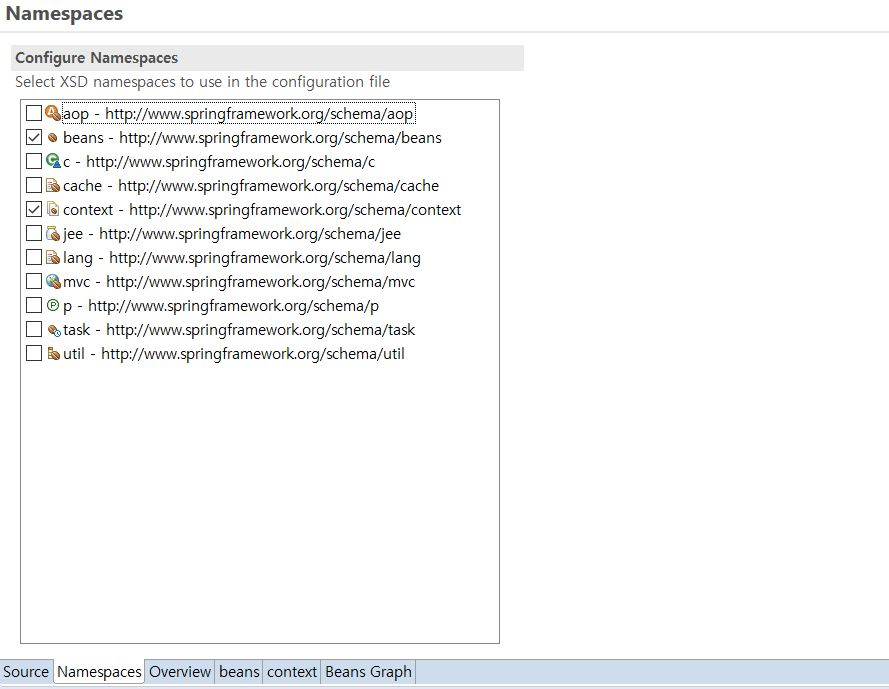

그 후 'Source' 탭에 아래의 코드를 추가한다.
```
<?xml version="1.0" encoding="UTF-8"?>
<beans xmlns="http://www.springframework.org/schema/beans"
	xmlns:xsi="http://www.w3.org/2001/XMLSchema-instance"
	xmlns:context="http://www.springframework.org/schema/context"
	xsi:schemaLocation="http://www.springframework.org/schema/beans https://www.springframework.org/schema/beans/spring-beans.xsd
		http://www.springframework.org/schema/context http://www.springframework.org/schema/context/spring-context-4.3.xsd">
	
	<!-- Root Context: defines shared resources visible to all other web components -->
		<context:component-scan base-package="org.zerock.sample"></context:component-scan>
</beans>
```

그러면 'Bean Graph' 탭에서 Restaurant와 Chef 객체가 빈으로 등록된 것을 볼 수 있다.

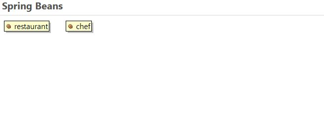

### **빈 등록 방법 - 어노테이션과 Config를 통해 빈을 등록하는 방법** ###

applicationContext.xml 방식은 새로운 객체가 나올 때마다 등록해주어야하고, ApplicationContext 팩토리(객체) 역시 생성해줘야 하므로 번거롭다.   
그래서 최근에는 어노테이션과 JAVA Config를 통한 방법을 선호한다.

각각에 필요한 Config Class를 생성한다 여기서는 ApplicationConfig를 생성해준다. 그 후 이 클래스가 Config파일임을 알려주기 위해 **@Configuration 어노테이션을 사용**한다.

```
@Configuration
public class ApplicationConfig {

}
```

그 다음으론, Bean을 등록해주어야 한다.

```
@Configuration
public class ApplicationConfig {
    @Bean
    public Car car(Engine e){
        Car c = new Car();
        c.setEngine(e);
        return c;
    }

    @Bean
	public Engine engine() {
		return new Engine();
	}
}
```

이와 같이 등록하였다면 

```
[main]
public static void main(String[] args) {
    ApplicationContext ac = new AnnotationConfigApplicationContext(ApplicationConfig.class);
    
    Car car = (Car)ac.getBean(Car.class);
    car.run();
}
```
처럼 사용할 수 있다.

### **빈 등록 방법- Java 설정(@ComponentScan을 이용한 방법)**

하지만 위와 같은 코드는 applicationContext.xml보다 편리하지 않아 보인다. 좀 더 다양한 어노테이션을 이용해 더 간결하게 바꿀 수 있다.

Java 설정을 이용하면 'root-context.xml' 대신 RootConfig 클래스를 이용한다.

@ComponentScan 어노테이션은 컨테이너에게 해당 패키지 내의 어노테이션들을 읽어 빈으로 등록하는 일을 한다. 따라서, 다른 지정이 안된 패키지에 @Component 어노테이션을 붙여도 인식을 하지 못한다.

@ComponentScan 어노테이션이 읽는 어노테이션(= 빈이 되는 객체)

- Component
  - Controller
  - Service
  - Repository

Controller, Service, Repository는 @Component 어노테이션을 포함하고 있다.

```
주로 ApplicationConfig 나 RootConfig로 명명하여 처리
[ApplicationConfig.java]
@Configuration
@ComponentScan("kr.or.connect.diexam01")
public class ApplicationConfig02 {

}
```
이렇게 등록을 해주면 컨테이너가 "kr.or.connect.diexam01" 패키지 내의 클래스를 돌며 컨트롤러,서비스,레파지토리,컴포넌트 등의 어노테이션을 읽어 빈으로 등록한다.

그러면 Car와 Engine 클래스도 아래 처럼 간편해진다.

```
[Engine.java]
@Component  //Component 어노테이션
public class Engine {
	public Engine() {
		System.out.println("Engine 생성자");
	}
	public void exec() {
		System.out.println("엔진이 동작합니다.");
	}
}

[Car.java]
@Component
public class Car {
	@Autowired
	private Engine v8;
	
	public Car() {
		System.out.println("Car 생성자");
	}
	
//	public void setEngine(Engine e) {
//		this.v8 = e;
//	}
	
	public void run() {
		System.out.println("엔진을 이용하여 달립니다.");
		v8.exec();
	}
}
```
Car와 Engine을 읽을 수 있도록 @Component 어노테이션을 붙이고, Setter와 Getter 메서드를 통한 객체 생성이 필요없어졌다.

### **빈 꺼내는 방법 - getBean() 이용**

ApplicationContext에서 직접 getBean()으로 직접 꺼내서 사용할 수 있다.

```
ApplicationContext ac = new  AnnotationConfigApplicationContext(원하는 객체.class);

클래스 타입 클래스 변수 = ac.getBean();
```

### **빈 꺼내는 방법 - @Autowired 이용**

@Autowired 어노테이션을 이용하여 ApplicationContext의 빈을 사용할 수 있다. 

```
@Autowired
String kesuen;
```

### @Autowired로 의존성 주입 방법, 위치

1. 생성자

기본적으로 스프링은 4.3버전 이후부턴 생성자가 하나만 존재하고 또, 그 생성자에 파라미터로 등록된 빈을 받을 시 **@Autowired 어노테이션이 없어도 객체를 생성해준다.**  

```
@Controller
class OwnerController {
    public OwnerController(OwnerRepository clinicService) {
    this.owner = clinicService;
    }
}
```

2. 필드

필드에서 등록된 빈을 받을 수 있다.
```
@Autowired
private final OwnerRepository owners;
```

3. Setter

이 클래스에 빈에 대한 Setter가 있을 경우 필드에 @Autowired를 붙인 것보단 Setter를 통해 @Autowired로 의존성을 주입해주는 것이 좋다.

### **Spring에서 제공하는 IoC/DI 컨테이너**

- BeanFactory
  - IoC/DI에 대한 기본 기능을 가지고 있다.
  - 기본적인 Factory

- ApplicationContext 
  - 컨테이너(레파지토리, 컴포넌트, 서비스)등의 내부에 있는 객체들의 의존성을 관리해준다.
  - BeanFactory의 모든 기능을 포함하며, 일반적으로 BeanFactory보다 추천된다.
  - 트랜잭션처리, AOP등에 대한 처리를 할 수 있다. BeanPostProcessor, BeanFactoryPostProcessor등을 자동으로 등록하고, 국제화 처리, 어플리케이션 이벤트 등을 처리할 수 있다.
  - 직접 사용하려면 ApplicationContext 자체가 bean으로 등록되어 있으니 `@Autowired - ApplicationContext applicationContext`를 이용해서 사용하면 된다.

  ```
  @Autowired
  ApplicationContext applicationContext;

  @GetMapping("/context")
  public String context(){
      return "hello" + applicationContext.getBean("빈");
  }
  ```

  servlet 3.0 이후 부터 자바코드를 통한(annotation) 설정이 가능해지고, 또한 spring boot가 나오면서 이러한 설정이 기본 제공 설정으로 바뀌면서 보기 힘들어졌다.

## **스프링의 계층**

### **데이터 엑세스(Data Access) / 통합(Integration)**

스프링의 데이터 엑세스/통합 계층은 JDBC, ORM, OXM, JMS 및 트랜잭션 모듈로 구성되어 있다.

- spring-jdbc : 자바 JDBC프로그래밍을 쉽게 할 수 있도록 기능을 제공한다.

### **웹(Web)**

스프링의 웹 계층은 spring-web, spring-webmvc, spring-websocket, spring-webmvc-portlet 모듈로 구성되어 있다.

- spring-web : 멀티 파트 파일 업로드, 서블릿 리스너 등 웹 지향 통합 기능을 제고, HTTP클라이언트와 Spring의 원격 지원을 위한 웹 관련 부분 제공
- spring-webmvc : Web-Servlet 모듈이라고 불리며, Spring MVC 및 REST 웹 서비스 구현을 포함한다.

## **Spring JDBC**

스프링은 데이터베이스를 다루기위한 JDBC에 쉽게 접근하기 위해서 Spring JDBC를 제공한다.

### **JDBC 란?**

[JDBC](https://github.com/dnwlsrla40/INFO_Repo/blob/master/JDBC.md)는 JAVA에서 데이터베이스에 접속할 수 있도록하는 자바 API이다.

사용법 등을 알아보고 싶다면 위의 링크를 들어가면 된다.

위쪽의 JDBC를 사용하다 보면, 반복적인 개발 요소가 있다.
이처럼 반복적인 JDBC의 저수준 세부사항을 Spring프레임워크가 처리해준다.

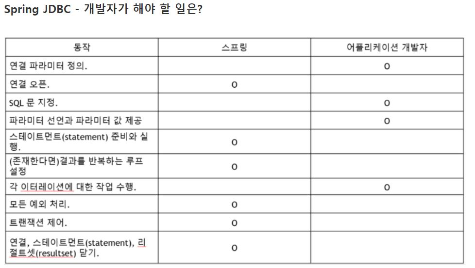

따라서 우리는

1. 실행할 SQL 정의 (String sql = "..." 방식 or 객체 생성 후 적어주는 방식)

```
[RoleDaoSqls.java]
public class RoleDaoSqls {
	public static final String SELECT_ALL = "SELECT role_id, description FROM role order by role_id";
	public static final String UPDATE = "UPDATE role SET description = :description WHERE ROLE_ID = :roleId";
	public static final String SELECT_BY_ROLE_ID = "SELECT role_id, description FROM role WHERE role_id = :roleId";
	public static final String DELETE_BY_ROLE_ID = "DELETE FROM role WHERE role_id = :roleId";
} 

후에 사용하는 곳에서 import static RoleDaoSqls.*;를 해주어야 한다.
```

2. 바인딩될 파라미터 설정

```
SqlParameterSource params = new BeanPropertySqlParameterSource(role);

or

Map<String, ?> params = Collections.singletonMap("roleId", id);
```

3. 넘겨받을 객체 설정

만 해주면 데이터를 사용할 수 있다.

### **DAO 패턴**

Spring은 비지니스 로직과 데이터 액세스 로직을 분리하기 위하여 [DAO](https://github.com/dnwlsrla40/INFO_Repo/blob/master/DAO.md) 패턴을 사용한다.

이를 통해 서비스 계층에 영향을 주지 않고 데이터 액세스가 가능하다.

### **Spring JDBC 패키지**

- org.springframework.jdbc.core
  - JdbcTemplate 및 관련 Helper 객체 제공
- org.springframework.jdbc.datasource
  - DataSource를 쉽게 접근하기 위한 유틸 클래스, 트랜잭션매니저 및 다양한 DataSource 구현을 제공
- org.springframework.jdbc.object
  - RDBMS 조회, 갱신, 저장등을 안전하게 사용하고 재사용 가능한 객체 제공
- org.springframework.jdbc.support
  - jdbc.core 및 jdbc.object를 사용하는 JDBC 프레임워크 지원

### **JDBC Template**

- jdbc.core에서 가장 중요한 클래스
- 리소스 생성, 해지 처리
- 스테이먼트 생성과 실행
- SQL 조회, 업테이트, 저장 프로시저 호출, ResultSet 반복 호출 실행
- JDBC 예외가 발생할 경우 org.springframework.dao패키지에 정의되어 있는 일반적인 예외로 변환

Spring JDBC의 모든 기능을 최대한 활용할 수 있는 유연성을 제공한다.  
실행,조회,배치 세가지 작업이 있다.

### **Connection Pool**

데이터를 위해 DataBase에 접근, 즉 DataBase에 연결하려 하는 것은 비용이 많이 든다.(실제 SQL실행시간보다 커넥션 객체 생성시간이 더 걸리게 된다.)

따라서 커넥션 풀은 미리 여러개의 Connection을 만들어 맺어두었다가 필요하면 빌려주고 끝나면 반납한다.

빠르게 반납하는 것이 중요하다.

다중 사용자를 갖는 엔터프라이즈시스템 즉, 웹어플리케이션에서는 반드시 DB커넥션 풀링을 지원하는 DataSource를 사용해야 한다.

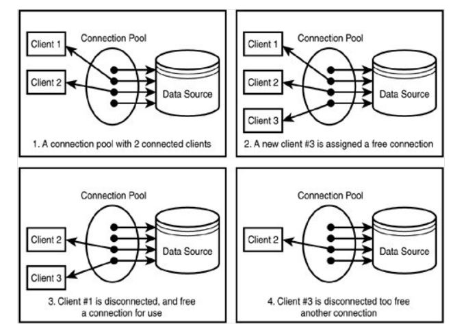

### **DataSource**

DataSource는 Connection Pool을 관리하는 목적으로 사용되는 객체이다.

DataSource를 이용해 커넨션을 얻어오고 반납하는 등의 작업을 수행할 수 있다.

스프링에서는 DataSource를 공유가능한 Spring Bean으로 등록해 사용할 수 있도록 해준다.

```
@Bean
public RoleDao(DataSource dataSource) {
		this.jdbc = new NamedParameterJdbcTemplate(dataSource); // JDBC Template 클래스 생성
		this.insertAction = new SimpleJdbcInsert(dataSource)
				.withTableName("role");
		
	}
```

### **사용되는 쿼리관련 메서드**

- queryForObject() 메서드 : 여러개의 칼럼, 한 개의 로우로 반환될 때 사용(id를 통한 조회)
- query() 메서드 : 여러개의 칼럼, 여러 개의 로우로 반환될 때 사용한다. (전체 조회)
- update() 메서드 : 파라미터 갯수는 가변인자(한개든 여러개든)가능하다. 결과값은 반영된 갯수이다.

```

queryForObject() 사용

public UserVO read(String id){
    String SQL = "select * from USERS where userid = ?"
    try{
        UserVO user = jdbcTemplate.queryForObject(SQL, new Objec[]{id}, new UserMapper());
        return user; 
    }catch(EmptyResultDataAccessException e){
        return null;
    }
}

query() 사용

public List<UserVO> readAll(){
    String SQL = "select * from USERS";
    List<UserVO> userList = jdbcTemplate.query(SQL, new UserMapper());
    return userList;
}

update() 사용

public void insert(UserVO user){
    String SQL = "insert into USERS (userid, name) vlaues (?,?)";
    jdbcTemplate.update(SQL,user.getUserId(),user.getName());
}
```

## **Spring MVC**

Spring 프레임워크는 모듈 중 하나인 Web 모듈에 MVC Model 2 아키텍처의 발전형태가 구현이 되어있다.

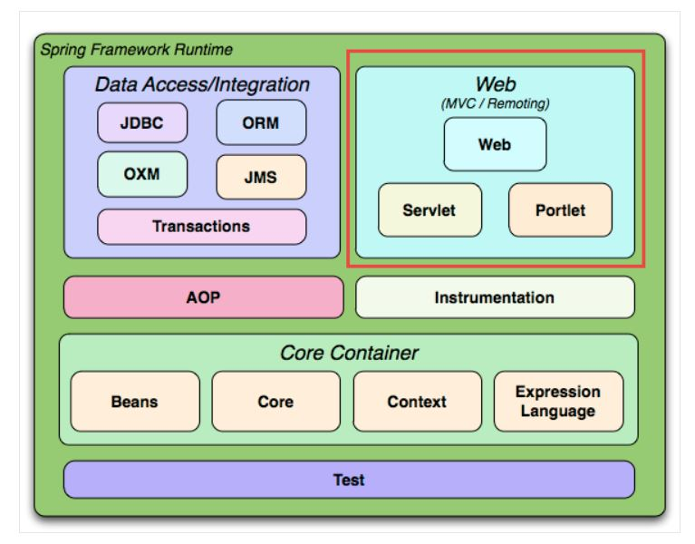

Spring MVC 기본 동작 흐름은 아래 그림과 같다.

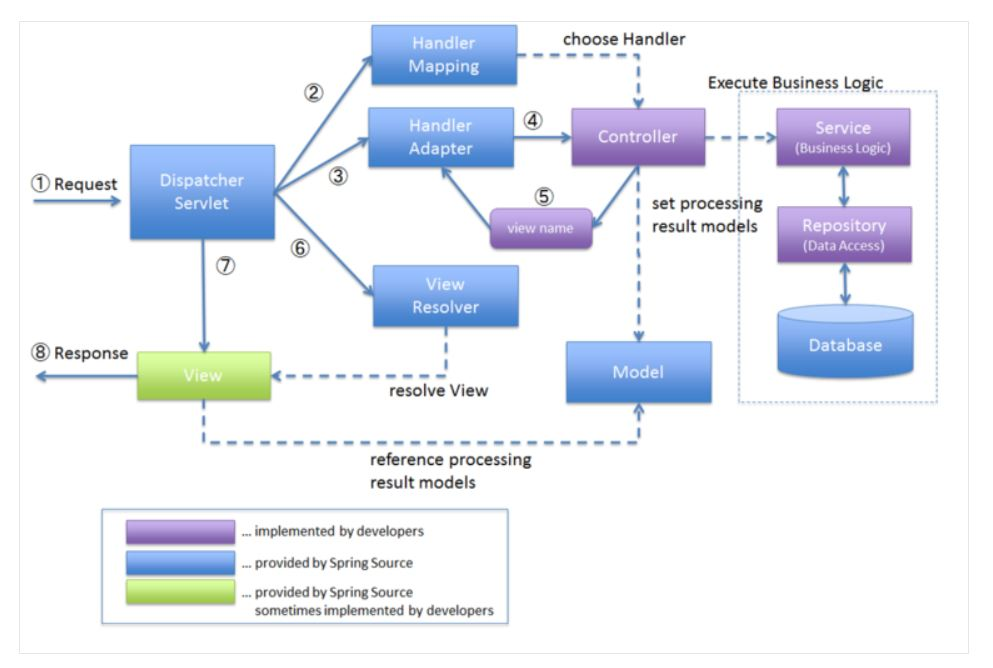

1. 클라이언트가 요청을 보내면, 모든 요청을 Dispatcher Serlvet이 받는다.

2. Dispatcher Servlet은 받은 요청을 처리해줄 컨트롤러와 메서드가 무엇인지 Handler Mapping에게 물어본다.

3. Handler Mapping은 개발자가 등록해둔 Controller관련 xml파일이나 java파일 어노테이션을 통해 알아낸다.

4. Handler Mapping을 통해 알아낸 적절한 Controller를 Dispatcher Servlet이 Handler Adapter에게 실행을 요청한다.

5. Handler Adapter는 매핑된 컨트롤러와 메서드를 실행한다.

6. 그 결과를 Model에 받아서 Dispatcher Servlet에게 전달한다.

7. 이때 Dispatcher Servlet은 컨트롤러가 리턴한 view name을 통해 View Resolver를 통해서 뷰를 출력한다.

이 그림에서 DataBase를 제외한 파란색 부분은 모두 Spring MVC가 제공하는 부분이다.

보라색인 부분들은 개발자가 구현해야하는 부분이다.

녹색은 Spring이 제공하는 부분과 개발자가 구현해야하는 부분 둘 다 존재하는 부분이다.

### **Model**

뷰가 렌더링하는데 필요한 데이터

ex)

사용자가 요청한 상품 목록, 주문 내역

### **View**

웹 어플리케이션에서 실제로 보이는 부분, 모델을 사용해 렌더링을 한다.  

JSP,JSF,PDF,XML등으로 결과를 표현한다.

### **Controller**

사용자의 액션에 응답하는 컴포넌트

모델을 업데이트하고, 다른 액션을 수행한다.

### **MVC Model 1 아키텍처**

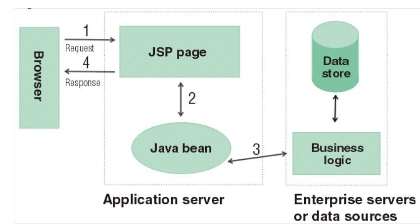

Model 1은 위와 같은 형태로 JSP Page가 Browser에 응답하므로 
요청만큼 JSP 페이지가 존재해야 한다.  

JSP page는 Java bean(Jdbc를 이용한 RoleDao)을 이용하여 데이터베이스를 사용해 응답한다.

Model 1 아키텍처는 JSP가 HTML과 JAVA 코드로 섞여있어 유지 보수가 어려웠다.

### **MVC Model 2 아키텍처**

.JPG)

Model 2 아키텍처는 요청은 서블릿이 받게하고 서블릿이 Java bean을 이용하여 DB에서 데이터를 꺼내오고 그 결과를 JSP를 통해 화면에 보여주도록 하는 방법을 사용한다.  

Controller - Servlet  
View - JSP  
Model - Data  

Model 2 아키텍처는 로직과 뷰를 분리할 수 있다.

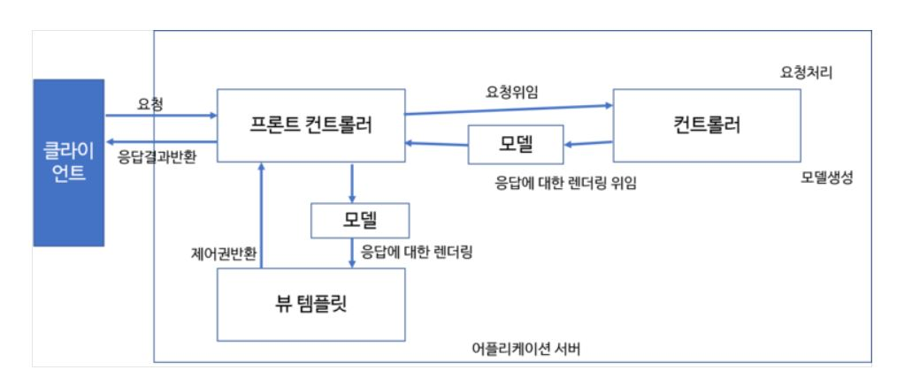

이 그림은 MVC Model2의 발전형태 이다.

클라이언트가 보내는 모든 요청을 프론트 컨트롤러라고 하는 서블릿 클래스가 다 받는다.

전체 서블릿은 이 프론트 컨트롤러 하나이다(이론적으론 하나이상 사용 가능).  
이 프론트 컨트롤러는 요청만 받지 요청의 처리는 핸들러 클래스 혹은 컨트롤러 클래스에게 위임하여 컨트롤러 클래스가 처리하게 한다.

컨트롤러 클래스는 Java bean을 이용하여 요청을 처리하고 그 결과를 모델에다 담고 프론트 컨트롤러에게 보내면 프론트 컨트롤러는 알맞은 뷰에게 모델을 전달해서 그 결과를 출력하게 된다.

### **Spring MVC 구성요소**

- DispatcherServlet
    - HandlerMapping
    - HandlerAdapter
    - MultipartResolver
        - 멀티파트 파일 업로드를 처리하는 전략
    - LocaleResolver
        - 지역 정보를 결정해주는 전략 오브젝트
        - HTTP 헤더의 정보를 보고 지역정보를 설정
    - ThemeResolver
    - HandlerExceptionResolver
    - RequestToViewNameTranslator
    - ViewResolver
    - FlashMapManager
        - FlashMap 객체를 조회&저장을 위한 인터페이스
        - RedirectAttributes의 addFlashAttribute메서드를 이용해서 저장
        - 리다이렉트 후 조회를 하면 바로 정보는 삭제

### **DispatcherServlet 내부 동작 흐름**

### Dispatcher Servlet

Dispatcher Servlet은 모델 2 아키텍처 발전형태의 프론트 컨트롤러라고 한다.

프론트 컨트롤러는 이론적으로는 한 개 이상 사용될 수 있다고 하는데 보통은 한 개만 선언해서 사용한다.

클라이언트의 모든 요청을 받은 후 이를 처리할 핸들러에게 넘기고 핸들러가 처리한 결과를 받아 사용자에게 응답 결과를 보여준다.

DispatcherServlet은 위의 여러 컴포넌트를 이용해 작업을 처리한다.

### Dispatcher Servlet 내부 동작

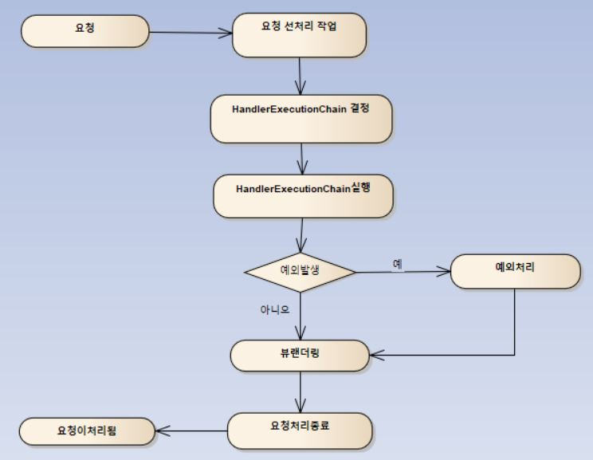

Dispatcher Servlet은 요청을 받으면 위와 같은 내부 동작을 거친다.

1. 선처리 작업
2. HandlerExecutionChain 결정 및 실행
3. 예외 발생 시 예외처리
4. 뷰 렌더링
5. 요청 처리 종료

자세한 사항은 아래를 보자.

### 선처리 작업

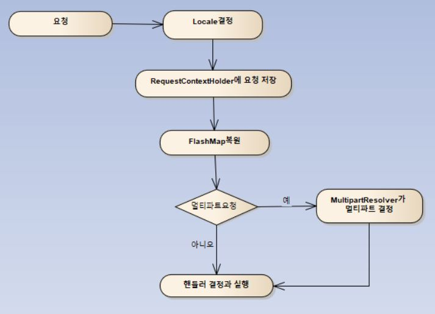

1. Locale 결정
    - 지역화(브라우저 언어 세팅에 따른 페이지 지원)을 해준다.

2. RequestContextHolder 요청 저장
    - RequestContextHolder는 스레드 로컬 객체이다.
    - 요청을 받아서 응답할 때까지 HttpServletRequest, HttpServletResponse등을 Spring이 관리하는 객체 안에서 사용할 수 있도록 해준다.
    - 이를 통해 Controller의 메서드안에서 Request 객체가 필요할 때 매개변수로 HttpServletRequest request 선언해주면 사용할 수 있다.

    ```
    반환형 function(HttpServletRequest request){

    }
    ```
    
    - 하지만 이 방식은 Spring이 웹 기술에 종속되는 문제점을 가지기도 한다.

3. FlashMap 복원
    - Spring 3에서 추가된 기능
    - redirect로 값 전달할 때 ?, 파라미터 이런 것을 사용하면 URL이 굉장히 복잡하다.
    - FlashMap을 사용하면 redirect될 때, 딱 한 번 값을 유지시킬 수 있게 해주는 역할을 한다.

4. MultipartResolver 요청
    - 파일 업로드를 했을 경우에는 파일 정보를 읽어들이는 특수한 형태의 Request 객체가 필요(HttpServletRequest와 다른 Request객체)
    - 이런 멀티 파트 요청이 들어오면, Request를 MultipartResolver가 이런 멀티 파트를 결정하게 해주는 것

5. 실제 요청을 처리하는 핸들러를 결정하고 실행

### 요청 전달 - HandlerExecutionChain 결정

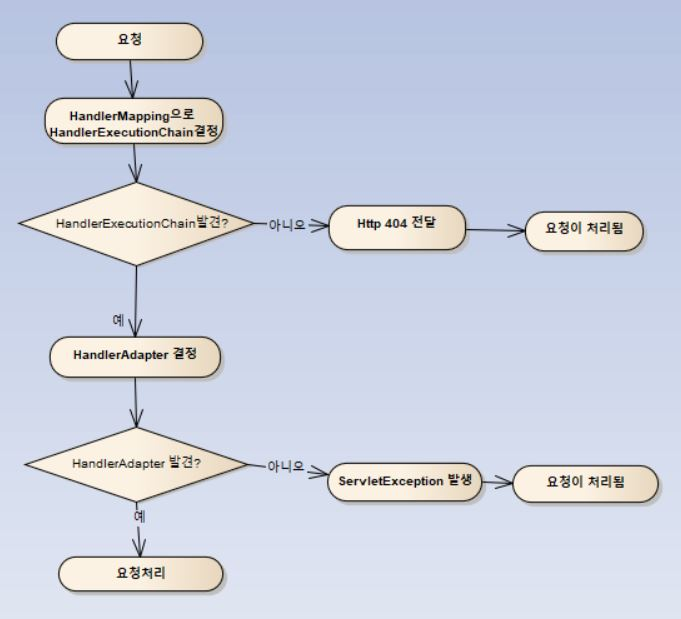

1. HandlerMapping으로 HandlerExecutionChain을 결정

2. HandlerExecutionChain이 없다면 페이지가 없으므로 Http 404 전달, 있다면 HandlerAdapter 결정 

3. HandlerAdapter이 없다면 서버 문제이므로 ServletException 발생, 있다면 요청 처리

### 요청 처리 - HandlerExecutionChain 실행

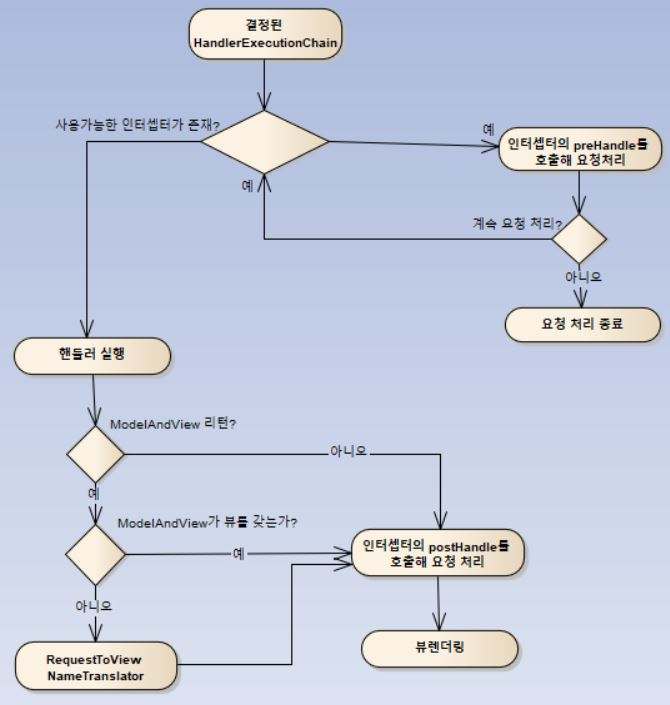

1. HandlerExecutionChain이 결정되었다면, 사용가능한 인터셉터(일종의 필터)가 존재하는 지 찾는다.

2. 인터셉터가 존재한다면, 인터셉터의 preHandle을 호출해서 요청을 처리하고 핸들러 실행

3. 핸들러가 실행된 후엔 결과값을 리턴하게 되는데 결과가 ModelAndView객체면서, 적절한 뷰가 없을 때 RequestToViewNameTranslator가 동작, 그외에는 인터셉터의 postHandle을 호출해서 요청을 처리하고 뷰 렌더링을 한다.

### 예외 처리

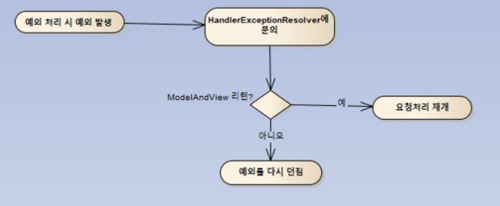


1. HandlerExceptionResolver에서 해당 예외가 있는 지 검색

2. 있다면 예외처리, 없다면 다시 예외를 던짐

### 뷰 렌더링

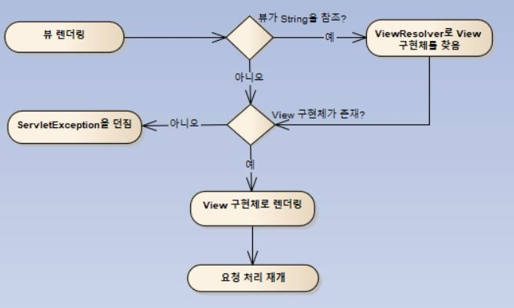

1. 뷰가 String인 경우, ViewResolver로 View 구현체를 찾음

2. 있다면 View구현체로 렌더링, 없다면 ServletException을 던짐

### 요청 처리 종료

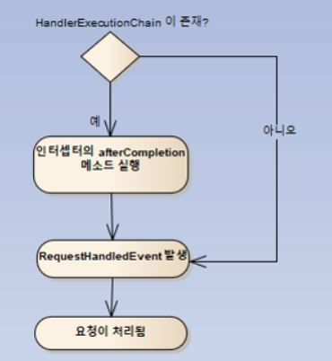

1. HandlerExecutionChain이 존재한다면, 인터셉터의 afterCompletion 메서드 실행

2. RequestHanlderEvent 발생

3. 요청 처리 완료

## **Spring XML**

spring 프로젝트 구동 시 관여하는 XML은 web.xml, root-context.xml, servlet-context.xml 파일이 있다.

### Web.xml

Tomcat 구동과 관련된 설정을 주로 한다.

프로젝트 실행시 가장 먼저 구동되는 Context Listener가 등록되어 있다.

```
<context-param>
    <param-name>contextConfigLocation</param-name>
    <param-value>/WEB-INF/spring/root-context.xml<param-value>
</context-param>
```

이처럼 context-param에는 root-context.xml의 경로를 설정

Intellij도 web.xml이라 되어있다.

### root-context.xml

스프링에 관한 설정파일이다.
빈에 관한 설정을 주로 한다.

인텔리 제이에선 applicationContext.xml라고 한다.

### servlet-context.xml

웹과 관련된 스프링 설정파일이다.
내부 웹 관련 처리 작업을 설정한다.

Intellij 에선 dispatcher-servlet.xml라고 한다.